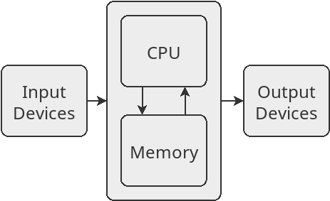

Chapter 1: The Road Ahead
=========================

------------------------------------------------------------------------

::: {.blackbox}
::: {.blackbox-title}
**Learning Objectives**
:::

::: {.blackbox-contents}
-   Understand the concept of an algorithm.
-   Understand how computers work and execute programs.
-   Become familiar with what you can do with computer science.
:::
:::

1.1 What is Computer Science?
-----------------------------

------------------------------------------------------------------------

This book is an introduction to the field of computer science, so we
will begin by talking about what computer science is. Unlike other
areas, like biology or history, this may not be that obvious. People
often are confused about what computer science actually is all about. In
particular, it is **not** any of the following things:

-   The study of how to build computer hardware (this is "computer
    engineering").
-   The practice of setting up computer systems and installing things on
    them (this is "information technology").
-   The use of computer applications such as email clients, word
    processors and spreadsheets (this is "computer literacy").

Instead, computer science is all about algorithms. An **algorithm** is a
detailed, step-by-step procedure for solving a particular problem.
Algorithms are essentially instructions that tell us how to solve a
problem from beginning to end. They are similar to recipes. When you
follow a recipe, you also perform the instructions given one by one. The
difference is that the result of your work when following a recipe is a
food of some kind (hopefully cake). The result of your work following an
algorithm is a solution to a problem.

The study of algorithms actually predates the existence of computers by
thousands of years[^1]. One of the first known
algorithms was described by the Greek mathematician Euclid in his book
*Elements* around 300 BCE. The algorithm was to find the greatest common
divisor between two numbers. For example, the greatest common divisor of
12 and 30 is 6 because 6 is the biggest number that goes into both 12
and 30 evenly. We'll take a look at Euclid's algorithm in Chapter 6.


Other mathematicians devised algorithms for solving other problems, such
as adding, multiplying, factorizing, finding roots of equations, etc.
The word "algorithm" itself comes from the name of Muḥammad ibn Mūsā
al-Khwārizmī, a Persian mathematician who wrote on algorithms for
solving algebra and arithmetic problems. The word "algebra" also comes
from the title of one of al-Khwārizmī's books.


You actually have learned several of these sorts of mathematical
algorithms yourself while in school. For example, if I asked you to add
137 to 226, you could do so (even though you probably have never added
these specific numbers before). That's because you learned an algorithm
as a child for adding numbers like this. That algorithm will allow you
to add any two numbers by following its step-by-step process.

One really important aspect of algorithms is that you can use them to
solve problems *whether or not you understand how the algorithm is
working*. This was important in the past because it meant you only had
to be really clever once, to come up with the algorithm in the first
place. After that you, and anyone else, could just follow the
algorithm's instructions to solve new problems with it. As a child, you
didn't have to understand all of the logic behind the adding algorithm
to use it. Nowadays this is even more important because most algorithms
are not followed by people, but by computers. Computers don't
understand anything, but they can be made to follow the steps of an
algorithm automatically.

1.2 Algorithm Design
--------------------

------------------------------------------------------------------------

One major part of computer science is *designing* algorithms. As we will
see throughout this book, there are many problems that can be solved
with a good algorithm. Designing algorithms can be a fun and challenging
activity. It involves both sides of your brain in that it takes both
logic and creativity to do.

Let's look at an example of an algorithm to solve the "guess the
number" game. In the simplest version of this game, one player thinks
of a number between 1 and some upper limit. Then the other player
guesses which number they picked until they get it.

Let's say that Mark and Sofia are playing this game with an upper limit
of 10. The game might go like this:

```
    Mark: I'm thinking of a number between 1 and 10.
    Sofia: Is it 7?
    Mark: No.
    Sofia: Is it 3?
    Mark: No.
    Sofia: Is it 2?
    Mark: No.
    Sofia: Is it 8?
    Mark: Yes.
```

In this case, Sofia solved the problem by eventually guessing Mark's
number. Now we'll consider writing an algorithm which will always solve
the game, no matter what number Mark picks.

Sofia tried numbers in a sort of random order until she hit on the right
one. Most people would do this, but it isn't really necessary. Instead
we could just start at 1, and then guess 2, and then 3 and so on until
we get the right number. So this particular algorithm won't solve the
problem the same way a person might, but that's OK. An algorithm for
doing this could be written as:

**Algorithm 1**
``` {.algorithm}
1. Set G to 1.
2. Ask if their number is G.
3. If it was, then we are done!
4. If it was not, then add 1 to G.
5. Go back to step 2.
```
This algorithm[^2] works by keeping track of
which number we are going to be guessing next, which we call "G". This
is a **variable**, which is a very important concept in programming. A
variable is a name that we give to a value which may change as the
algorithm is run. They are like variables in math, but are used somewhat
differently. In math, you often have to solve for a variable which has
one value that you just need to find. In computer science, variables
change values as the algorithm progresses. Here, G starts off at 1, but
it will change.

In step 2, we ask the other player if their number is G or not. Of
course we don't ask them if they literally picked "G". Only numbers
are allowed in this game, not letters! Instead the algorithm means that
we should instead ask if their number is the *current value* of G,
whatever that happens to be. The first time it will be 1, but as we have
said, G will change.

In step 3 and 4, we are going to do different things based on whether or
not the guess was correct. If it was, then the algorithm is done. If
not, we add 1 to the variable G. When the algorithm first reaches this
step, it will change G from 1 to 2.

Step 5 is crucial here. It tells us to go back to step 2. This creates a
**loop**, which is when an algorithm does the same step or steps
multiple times. Even though only step 2 makes a guess, the algorithm can
keep on guessing numbers because of the loop.

We'll now trace through the algorithm to see how it works. Let's
suppose that we pick 3 as our number and see if the algorithm can guess
it. The algorithm will go step by step as follows:

1.  It will start with step 1 and set G to 1.
2.  Next it will go onto step 2 and ask us if the number is G (currently
    1).
3.  We will respond that no, it is not.
4.  The algorithm will then skip over step 3 (we aren't done yet) and
    go to step 4.
5.  In step 4, the algorithm will add 1 to G. Now G is going to be 2.
6.  Step 5 will then move the algorithm back to step 2.
7.  Back at step 2, the algorithm will ask us if the number is G (which
    is now equal to 2).
8.  We will tell it no.
9.  The algorithm will again skip over step 3 and go to step 4.
10. In step 4, the algorithm will again add 1 to G. This changes it from
    2 to 3.
11. Step 5 sends the algorithm back to step 2 again.
12. The algorithm will again ask us if the number is G (which is now 3).
13. This time, we tell it yes, since our number was 3.
14. The algorithm then sees this in step 3 and stops.

One important part of working with algorithms is *testing* them. This
involves stepping through the algorithm line by line like this to see
how it's working. Hopefully you're convinced that the algorithm will
try every number until it gets the right one.

1.3 Another Version of the Game
-------------------------------

------------------------------------------------------------------------

Next we will look at a more interesting variation of this game. In this
variation, instead of just answering "no" for an incorrect guess, the
player will either say that the guess was too low, or too high. Again,
consider an example with two players. This time, the limit will be 100:

    Mark: I'm thinking of a number between 1 and 100.
    Sofia: Is it 50?
    Mark: Too high.
    Sofia: Is it 25?
    Mark: Too low.
    Sofia: Is it 37?
    Mark: Too low.
    Sofia: Is it 44?
    Mark: Too high.
    Sofia: Is it 40?
    Mark: Yes.

This time, Sofia did not just guess numbers randomly until she hit on
the right one. By having the extra information, she's able to guess
more intelligently. Her first guess of 50 was the best she could have
done to start with. The reason is because that way, no matter what Mark
answered, she had half the potential numbers eliminated. When Mark said
50 was too high, Sofia knew the number must have been between 1 and 49.
Had Mark instead answered that 50 was too low, then Sofia would know the
number had to be between 51 and 100. Either way, half the possibilities
were cut out.

Sofia used this trick again with her second guess. When she knew the
number was between 1 and 49, she guessed right in the middle, which gave
her 25. To get this "middle value", we can just add the numbers and
divide by 2. She kept on doing this until she hit on the right number.
This algorithm can be given like this:

**Algorithm 2**

``` {.algorithm}
1. Set min to 1.
2. Set max to 100.
3. Set G to (max + min) ÷ 2 (rounding down if needed).
4. Ask if their number is G.
5. If it is, then we are done!
6. If the guess was too high, set max to (G - 1).
7. If the guess was too low, set min to (G + 1).
8. Go back to step 3.
```

This algorithm is just bit more complicated than the last one. Now we
have three variables involved. `min` is used to keep track of the
smallest number the other player could be thinking of. Likewise `max`
keeps track of the biggest number it could be. For example, if we have
narrowed it down so we know the number is between 20 and 40, then min
would be 20 and max would be 40. These variables will change as we
narrow down the possibilities. `G` is once again used for the number we
are going to guess.

The algorithm starts by setting min and max to reflect the fact that the
number could be anywhere between 1 and 100 to start with. Then step 3
figures out which number to guess. The first time we do this, we will
get 100 plus 1, divided by 2, which gives 50.5. The note about rounding
down if needed is to make sure we always guess a whole number, in this
case 50.

After each guess, there are 3 possibilities. If we got the guess right,
then we are done, just like before. If we guessed too high, then that
means that we need to change our max variable. We set it to whatever our
last guess was, minus 1. To see why, consider the starting case where
min is 1, max is 100, and G is 50. If the guess of 50 was too high, then
the number must be between 1 and 49. So we 49 as the new max value.
Similar logic holds for when the guess was too low.

Finally we go back to step 3 to pick a new guess again. This algorithm
will eventually guess the correct number for playing this version of the
game. I would encourage you to try it yourself once or twice to convince
yourself that it works.

The things these two algorithms are doing, such as changing variables,
checking different conditions, and going back to previous steps, are the
same things pretty much all the algorithms we will look at in this book
will do. You'll see that we can use these building blocks to solve all
kinds of interesting problems.

1.4 Algorithm Analysis
----------------------

------------------------------------------------------------------------

Another major part of computer science is *analyzing* algorithms.
Oftentimes a problem will have more than one algorithm to solve it. We
then will want to compare the algorithms and see which takes less steps.
We now have two algorithms we can analyze. Notice that we could use both
algorithms for the second variant of the game (where the player answers
too low or too high instead of just no). The first algorithm would just
guess starting at 1 all the way up until it got the number. But which
algorithm is better? And by how much? These are the questions of
algorithm analysis.

When analyzing algorithms, we want to know how many steps they take in
different cases. We often consider the average case or the worst case.
The average case is helpful because it gives you an idea of how long the
algorithm will usually take. The worst case is helpful because it gives
you a guarantee on how long it will take. If the algorithm performs well
enough in the worst case, you know it will work well for you. The best
case is usually not very interesting. Here we will focus on the worst
case.

Let's consider algorithm 1 first (the one that just starts at 1, then
2, then 3, etc.). If we are playing the game between 1 and 100, what's
the most number of guesses that the algorithm could take? Clearly the
worst case is that the other player chose 100 as his or her number,
because that would be the algorithm's last guess. In this case, we
would have to make 100 guesses before we get it right. If we were
playing between 1 and 1,000 then we would need 1,000 guesses in the
worst case.

Analyzing algorithm 2 is more complicated. The worst case with this
algorithm is that we never "get lucky" by guessing the number
correctly until we are 100% sure of what it is. We are only 100% sure
when we have narrowed down the range to 1 number, and min and max are
the same value. Below is an example of when this could happen:

    > min = 1, max = 100.  Is your number 50?
    Too high.
    > min = 1, max = 49.  Is your number 25?
    Too low.
    > min = 26, max = 49.  Is your number 37?
    Too low.
    > min = 38, max = 49.  Is your number 43?
    Too high.
    > min = 38, max = 42.  Is your number 40?
    Too high.
    > min = 38, max = 39.  Is your number 38?
    Too low.
    > min = 39, max = 39.  Is your number 39?
    Yes.

As you can see, the algorithm was not lucky enough to get the number
right until the very end when it had eliminated all the other
possibilities. In this worst case it took 7 guesses to get the number.
There are other worst case numbers, but they all take 7 guesses to
reach.

The number 7 here comes from the number of times we can cut the
possibilities in half before we run out. There were 100 possibilities to
begin with, and with each guess we eliminate half of them. If we
repeatedly divide 100 by 2 (rounding down because we eliminate the
guessed number itself as well), then we get this sequence of numbers:

    100
    50
    25
    12
    6
    3
    1

Because we can cut 100 in half 7 times before we hit 1, our algorithm
takes 7 guesses in the worst case[^3]. Below is
a table showing the number of guesses needed in the worst case for both
algorithms, based on the highest number the other player could pick:

  Highest Number   Algorithm 1 Guesses   Algorithm 2 Guesses
  ---------------- --------------------- ---------------------
  10               10                    4
  100              100                   7
  1,000            1,000                 10
  1,000,000        1,000,000             20
  1,000,000,000    1,000,000,000         30

It is sort of amazing that we can ask algorithm 2 to guess a number
between 1 and 1 billion, and it will need only 30 guesses at most to get
it! Algorithm 2 is not just a bit better for this problem, it's way
better. If you were to follow Algorithm 2 with a billion as the highest
number, you'd be done in a few minutes. If you used Algorithm 1, and
you guess one number per second (with no breaks for eating and
sleeping), it would take you more than 31 *years*.

It's actually pretty common in computer science for there to be huge
differences in speed between different approaches like this. Oftentimes
the obvious solution is not very efficient, but a more clever one is.
This book will spend more time on algorithm design than analysis, but it
is an important part of computer science and we will touch on it from
time to time.

1.5 What is a Computer?
-----------------------

------------------------------------------------------------------------

Computer science is primarily the study of algorithms, but computers do
play a role as well. In this section we will talk about what computers
are, what programs are, and how computers can run programs.

It might seem a bit silly to define what a computer is, since you likely
use a computer every day and clearly know what one is. However, we will
define a **computer** as any device that is capable of running
algorithms automatically. The earliest computers were created to run a
handful of particular algorithms, and couldn't do anything else.

One of the earliest such devices was Pascal's calculator, also called a
Pascaline. This device, created by the French mathematician Blaise
Pascal in the mid-1600s, was capable of adding and subtracting numbers.
It could also do multiplication and division by means of repeated
additions or subtractions. A number of other mathematicians and
inventors made similar mechanical devices, including Gottfried Wilhelm
Leibniz.


Another pioneer in early computers was the British mathematician and
engineer Charles Babbage. He designed the difference engine, which could
compute polynomial values. He completed a prototype of the difference
engine in 1822. The difference engine was mechanical and was operated
with a hand crank. He began working on a larger version which could
operate on bigger numbers, with more precision.

Before the full difference engine was completed, however, Babbage began
working on a more ambitious project, the analytical engine. Babbage's
design of the analytical engine was a huge breakthrough in computer
science, because it was the first design for a *programmable* computer.
Pascal's calculator, the difference engine, and every other computing
device up until that point was designed to do one fixed task. If you
wanted it to solve a different problem, you had to build an entirely new
machine.

The analytical engine, on the other hand, was designed so that it could
execute any algorithm at all. It did this by taking the instructions
that it should execute as input, along with data values to be used in
the computation. These sets of instructions are the world's first
computer programs. The analytical engine's programs themselves were
created by punching holes in cards. The machine would then read the
cards in, and the patterns of holes would affect its behavior.


Babbage worked with Ada Lovelace, who was incidentally the daughter of
the poet Lord Byron. She worked on translating algorithms so that they
could be executed by the analytical engine. The first of these was a
program to compute the Bernoulli numbers. This was the first published
computer program. A **program** is an algorithm that is written
specifically for a computer to execute. Unlike Babbage and others, Ada
believed the analytical engine to be capable of going beyond number
crunching, including speculating that the engine could be used to create
music.


Unfortunately, the analytical engine was never completed, primarily due
to a lack of funding. A general-purpose computer was not actually
completed until more than 100 years after the design of the analytical
engine. In the 1940s, there were several working computers developed.
These include the Z4 by the German Konrad Zuse, the Colossus developed
in Great Britain to break coded messages, and the ENIAC developed at the
University of Pennsylvania to calculate ballistics trajectories.


Unlike the Analytical Engine, which was completely mechanical, these
computers used electronic circuitry. After these machines were
successfully built and used, there was no turning back, and computers
have been constantly built and improved upon until the present day.

Despite being as large as rooms, these older computer were laughably
limited compared to even the most basic of today's computers. The Z4
ran at 40 Hz and had 512 bytes of memory. The first iPhone, released in
2007, could run at 620 MHz (15 million times faster), and came with at
least 4 GB of memory (7 million times more).

While these older computers were woefully slow and had tiny memories,
they functioned in essentially the same way as every computer designed
since. They all consist of a processor, memory and some input/output
devices. Below is a simplified diagram of a computer system.



The **CPU** (which stands for central processing unit), is responsible
for carrying out the instructions of a program. Each instruction is very
simple and precise. For example, the following are examples of typical
CPU instructions:

-   Take the numbers in two memory cells add them together. Put the
    answer in another memory cell.
-   Check if one memory cell is equal to another. If so, jump to a
    different part of the program.
-   Check if a certain key on the keyboard is pressed. If so, set a
    memory cell to 1. Otherwise, set it to 0.

Although the individual instructions a CPU carries out are very basic,
enough of them put together are able to accomplish great things.

The **memory** of a computer is responsible for storing numbers.
Everything represented in a computer is done with numbers. For instance,
when you send an email, the text that you write must be stored inside
the computer as well. But, like everything else, this is done with
numbers. The letters and punctuation symbols have specific numbers
assigned to them. For instance when you type an 'A', the computer
stores a 65. When you type a period, the computer stores a 46. When you
type a space, the computer stores a 32[^4].

Of course, the way that computers store numbers is in *binary*, which
means they only use 1's and 0's. We will not talk about how to convert
back and forth between binary and decimal numbers. Just know that any
number can be stored in either binary or decimal, and they mean the same
thing. Even images and sounds are stored inside a computer as numbers.
We will talk about how that is done in later chapters.

**Input devices** include touch screens, mice, keyboards, game
controllers and so on. These are connected to a computer system so that
the user can influence the programs running on the computer. Likewise,
**output devices** are connected to a computer so that the user can see
what the computer is doing and see the result of the program which is
running. These include monitors, speakers, printers, and vibration units
(which can vibrate to provide the user feedback).

1.6 Programming Languages
-------------------------

------------------------------------------------------------------------

So the computer executes simple instructions, reads and writes its
memory, gets input from the user, and gives the user output. But where
do the instructions come from? They are actually stored inside the
computer's memory as numbers too! As an example of a computer
instruction, we can look at one of the steps of Algorithm 1 to solve the
simple guess the number game:

``` {.algorithm}
add 1 to g.
```

Let's look at what this step would look like as a real computer
instruction[^5]. But first, we would need to
decide what memory location to store `G` in. Let's say we put it in
location 7.

This instruction would tell the CPU to add 1 to memory location 7:

``` {.algorithm}
          operation     destination   input   amount
1110001   0100       0  0111          0111    00000001 0000
```

This is a *binary* number. We'll just point out some of the parts of
this. The 0100 labeled "operation" tells the CPU what sort of thing
it's doing. 0100 is the code for addition. So it tells the CPU to add
instead of subtract, multiply, or anything else.

The first 0111 labeled "destination" tells the CPU where to put the
result. 0111 is binary for 7. So it puts the answer in memory cell 7.
The second 0111, labeled "input" tells the CPU what value to read in
the addition. This is also 7. Lastly the 00000001 labeled "amount"
tells the CPU how much to add. In total the instruction tells the CPU to
read memory cell 7, add 1 to it, and put the answer back in memory cell
7.

The other, unlabelled parts just tell the CPU what type of instruction
it is, and how to interpret the other fields. All together the
instruction is the following binary number:

``` {.algorithm}
11100010100001110111000000010000
```

In decimal, this is equal to:

``` {.algorithm}
3800526864
```

So the way computers work is by reading in these numbers, which tell
them what they are supposed to do. Part of the computer's memory is
dedicated to storing these instruction numbers for the programs it runs.
It reads the instructions one by one and carries them out. Programs
stored as actual numbers like this are **machine code** programs.

In case you are panicking right now, let me assure you that nobody
actually writes programs this way! Giving a computer a program by
writing a sequence of numbers like this would be tedious beyond belief.

Instead, we have created other languages which are easier for people to
use. The first of these is **assembly** language, which is basically a
human-readable version of machine code. Rather than write "0100" for
add, and "0111" for memory cell 7, we just write them out. The
instruction above written in assembly would look like this:

``` {.algorithm}
add r7, r7, #1
```

The computer can't run this instruction directly, it must be translated
into machine code. That is done by a program called an **assembler**:


The assembler converts each line of assembly code into the corresponding
machine code instruction. Then, the machine code program can be run on
the computer system directly.

We aren't dealing with numbers directly with assembly code, but it is
still too tedious for most people. In particular, we still have to keep
track of where in memory our variables are stored. Knowing that memory
cell 7 is storing our guess variable, and knowing where the other
variables are becomes too hard as we begin to write larger programs.

Instead, we have developed **high-level** programming languages. These
allow us to have names for our variables, instead of needing to remember
which memory location they are in. Here is what the instruction above
looks like in Python, the high-level language used in this book:

``` {.algorithm}
guess = guess + 1
```

High-level language code is also much more succinct than assembly or
machine code. One line of code in a language like Python can do the same
work as many lines of machine code. Of course this code must also be
translated into machine code for the computer to execute. That is done
with a program called an **interpreter**.

An interpreter takes code in a language like Python, and executes in
line by line. For each line it sees, it gives one or more lines of
machine code to the computer:


Just like someone who interprets one spoken language into another, an
interpreter program translates on the fly. As the high-level program is
being run, its code is being translated for the computer to execute.

1.7 What do you do with Computer Science?
-----------------------------------------

------------------------------------------------------------------------

We have seen that computer science is primarily about algorithms, but
this section will address how algorithms are used in a variety of areas
to solve problems in the world.

Computer science is an interesting field because it frequently works
together with other fields. For example:

-   Computer scientists work with natural scientists in fields like
    physics, chemistry and biology to develop computer models of natural
    phenomenon. It is often impractical to carry out experiments in real
    life, so computer models can be used. For instance, there are
    programs which model the collision of two galaxies, the spread of a
    disease through a population, or the path of a river in the face of
    flooding. These models allow scientists to test hypotheses and
    compare potential solutions to problems more easily than they
    otherwise could.
-   Social scientists work with computer scientists as well. For
    example, economists work with programmers to create programs which
    model the way markets work. Computer scientists also work with
    historians and anthropologists to create virtual exhibits for
    historical artifacts.
-   Computer programs are also used in every area of industry. Programs
    determine the price of goods, they schedule flights, they manage
    factories and farms, and keep track of information in schools and
    hospitals. They are behind all of the web sites and apps that you
    use, and provide entertainment in the form of video games and
    special effects used in movies.

Some computer scientists work in "pure" computer science. These
include people who work on operating systems or the interpreters that
make languages like Python work. But the vast majority work with people
in some other area. Because so many different fields rely on programs, a
computer scientist can work in a variety of different areas over the
course of their career. All of this makes computer science an
interesting and rewarding field of study. No matter what you're
interested in, computer science can combine with it in some way.

Computer science also has a lower "barrier of entry" than most other
fields. You don't need any special equipment or materials. You can use
just about any sort of computer to write your programs (some people
assume you need a powerful or specific type of machine, but that's not
the case). It is also a field where you should feel free to experiment.
Unlike a chemistry student mixing up chemicals, there's really not much
you can do while programming that will cause any harm to you or your
computer.

::: {.blackbox}
::: {.blackbox-title}
**Chapter Summary**
:::

::: {.blackbox-contents}
-   Computer science is the study of algorithms. An algorithm is a set
    of directions for solving a problem. Algorithms must be precise
    enough that someone can use it to solve problems without needing to
    understand how it's working.
-   A computer is a device which can carry out the steps of an algorithm
    automatically. The oldest computers could only solve problems they
    were designed for. Nowadays computers can run different algorithms
    at different times.
-   For a computer to execute an algorithm, it must be programmed into a
    language that the computer can understand. Computers have a
    "native" machine language which is difficult for people to use.
    Most programs are written in an easier high-level language which is
    translated for the computer by an interpreter.
-   Computer scientists work to write programs that solve a variety of
    problems for lots of different fields.
:::
:::

Footnotes {#footnote-label .visually-hidden}
---------


[^1]: Before the advent of computers, the study of algorithms was not
    called "computer science". It was just part of mathematics. After
    computers were invented, it split off into its own field.

[^2]: This algorithm is written in "pseudocode" which is not real
    computer code, but is similar to computer code. For most of this
    book we will use real code, but for these first examples, we just
    want to talk about the concepts in general.

[^3]: For the mathematically inclined, the worst case number of guesses
    has the following relationship with the number of possibilities we
    start with: guesses = ⌈log~2~(possibilities)⌉

[^4]: These numbers are defined by the ASCII (American Standard Code for
    Information Interchange) code. Computer scientists do not need to
    remember these!

[^5]: The instruction in this example is for ARM-based computer systems.
    These include almost all phones, tablets and other small computers.
    Most laptops and desktops use a different format, but the ideas are
    the same.

