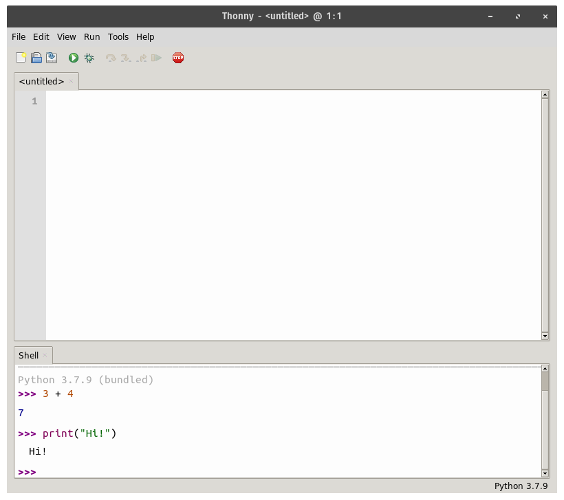

Chapter 2
=========

------------------------------------------------------------------------

Getting Started {#getting-started .sub}
===============

::: {.blackbox}
::: {.blackbox-title}
**Learning Objectives**
:::

::: {.blackbox-contents}
-   Understand what an interpreter, IDE, and shell do.
-   Learn how to install Python on your computer.
-   Know how to write and run simple Python programs.
:::
:::

2.1 Interpreters and IDEs
-------------------------

------------------------------------------------------------------------

As we learned in the last chapter, computers only directly understand
programs written in machine code. However, nearly all programs are
written in a high-level language. For this to work, we need an
interpreter program to translate the code into what the computer
understands.

So in order to run our programs, we have to install the interpreter for
the language that we want to use. Because we will be using Python, we
need to install the Python interpreter. If we just give Python programs
straight to our computer, it won\'t know what to do with them. We need
to interpreter to run them.

We will also be installing *another* program along with an interpreter.
This program is something called an **Integrated Development Environment
(IDE)**. An IDE is a program that lets you type in the program you are
writing. You could write your programs in any old program, but it\'s
generally much easier to use a program geared just for that purpose. For
example, an IDE will give you a button to pass your program to the
interpreter, highlight keywords in the language and make it easier to
see when you have errors.

The IDE we will be using here is a simple one called **Thonny**, which
is easy to use and get started with. It also includes Python with it, so
you only need to install one thing. The choice of IDE doesn\'t really
matter too much, if you want to use a different one for some reason (for
instance if you have one from another class), you can follow the rest of
the book using that too.

The rest of this chapter will guide you through setting up Python along
with our IDE for whichever type of computer system you have. Then, we
will see how to use it to run some Python code!

2.2 Installing Python on Windows
--------------------------------

------------------------------------------------------------------------

To install Python along with Thonny on Windows computers, go to the
[Thonny website](https://thonny.org/). Hover over the Windows link in
the download box at the upper right. Click the top link which is labeled
"Installer with 64-bit Python". Choose to save the file. When the
download is finished, run the installer program.

Click next, select the agreement, choose where to install it, and wait
for the installer to finish. Once it is done, you should have Thonny,
along with its Python interpreter installed.

2.3 Installing Python on Mac
----------------------------

------------------------------------------------------------------------

To install Python along with Thonny on a Mac OSX computer, go to the
[Thonny website](https://thonny.org/). Hover over the the Mac link in the
download box at the upper right. Click the link to the .pkg file and download
it to your computer.

When the download has finished, you should see the Thonny icon in a
window. Drag this icon into your applications folder to copy it to your
computer. You should then have it installed and be able launch Thonny
from your Application menu to start programming.

2.4 Installing Python on Linux
------------------------------

------------------------------------------------------------------------

While all recent versions of Linux come with Python, they do not come
with Thonny. To install it, open up a terminal and run the following
command:

``` {.algorithm}
bash <(wget -O - https://thonny.org/installer-for-linux)
```

Then hit Enter at the prompt to continue.

That should download the latest version, and install it on your
computer. You should be able to find Thonny amongst your installed
applications. You could also launch it by running the command:

``` {.algorithm}
~/apps/thonny/bin/thonny
```

2.5 The Shell Window
--------------------

------------------------------------------------------------------------

You should now have Python and Thonny installed. When you run it, you
should see a window something like this:


The main window has two main parts. The top is the file area. This is
where you will type in the program that you will create. This is empty
right now, and called \"\<untitled\>\".

The bottom area is called the **Shell**. This is a window where you can
pass Python code to the Python interpreter. Any code you put in here
will be run right away and the results will be given to you. Here is an
example:



As you can see, when we put `3 + 4` into the shell, it gives us the
answer, 7. Likewise when we put in the command `print("Hi!")`, it prints
what we told it to. What\'s happening here is that these are small
amounts of Python code. When we put them in, the shell window passes
them to the Python interpreter, which runs them. Any results are
displayed back in the shell. It is called a \"shell\" because it sort of
surrounds the Python interpreter and acts as our interface to it.

Generally, the top file area is for writing a program that you will run
all at once. This window saves what you put there so you can run it over
and over again as you work on a program. The bottom shell area is for
trying things out and experimenting. Unless you copy and paste it some
place else, the things you put into the shell window are not saved.

As you can see from the first example in the screenshot above, the shell
can work as a calculator. Try putting a few other simple math
expressions in and see how the shell gives you results back.

2.6 Our First Program
---------------------

------------------------------------------------------------------------

Now we are ready to write our first program. The goal of the first
program is just to print the text \"Hello World\" to the screen [^1].
The code for this program is the
following:

**Program 2.1**
``` {.python}
# this is our first program
print("Hello World!")
```

You should type this program into the top window of Thonny. Then we can
run the program. This can be done in one of three ways:

-   Clicking the \"Run\" menu, then choosing \"Run current script\".
-   Clicking the green play button ().
-   Hitting the F5 key.

Before the program can run, it will ask you to save it. When saving your
program files, you should put them some place where you will be able to
find them again. You should also always name them something ending with
the \".py\" extension.

Once the program is saved, it will run. You should then see the results
in the shell window:


2.7 About the Program
---------------------

------------------------------------------------------------------------

Now that we have seen how to run the program, we will talk about the
program itself a little bit. This program consists of two lines. The
first line says:

``` {.python}
# this is our first program
```

This line is a **comment**. Any line that starts with the \# symbol is a
comment in Python [^2]. When the interpreter
gets a comment line, it completely ignores it, and moves on to the next
line. The sole purpose of comments is to leave little notes in the code,
for any people reading. They are meant to explain things about how the
program works. This program is so short and simple that the comment is
not really needed, but as we work on more complex programs, they\'ll
become more helpful.

The second line of the program says:

``` {.python}
print("Hello World!")
```

This is the line that actually tells the Python interpreter to do
something. Python comes with lots of commands called **functions** built
in that cause it to do different things. One of these is `print`. The
parenthesis mark the things that will be printed. In this case, it\'s
just the message \"Hello World!\".

Both the parenthesis and the quotation marks are needed for the program
to work. You can change the message inside the quotation marks to
whatever you want though. Try changing it so that it prints out your
name.

2.8 When Things Go Wrong
------------------------

------------------------------------------------------------------------

We said that the parenthesis and quotes are needed, but what happens if
we get rid of them? In these cases, the Python interpreter will not be
able to figure out what to do with the code, and will give us an error
message. For instance, if we get rid of the quotation marks, we get
this:


Here the program did not run successfully. Instead, the shell gives us
the error `SyntaxError: invalid syntax`. There is also an \"Assistant\"
window which is a feature of Thonny to help us figure the error out. In
this case, it\'s not terribly helpful. The specific problem here is that
Python has no idea what to do with the exclamation mark since that
doesn\'t mean anything in Python code.

If we get rid of the parenthesis instead, we get a different error:


Here the error is much easier to figure out. It actually tells us what
is missing and even suggests a fix for it. Even though the two errors
were pretty similar, one would be much easier to figure out.

Errors can be stressful as a beginning programmer. Even if your code is
99% correct, one mistake can prevent the interpreter from being able to
figure it out. As you get more experience with programming, they get
easier and easier to fix. In the meantime, you can always ask your
friends or instructor for help.

Now that we are able to write and run Python programs, we will begin
delving into learning the language and starting to solve problems with
it!

::: {.blackbox}
::: {.blackbox-title}
**Chapter Summary**
:::

::: {.blackbox-contents}
-   An interpreter is a program that translates programs so that they
    can be executed by the computer. An IDE is a program that lets you
    write programs and passes them to the interpreter.
-   The Thonny IDE can be installed on Windows, Mac, or Linux. It has a
    file window for writing programs, and a shell window for running
    commands interactively.
-   Comments are lines starting with a \# and are little notes that are
    put into programs.
:::
:::

Footnotes {#footnote-label .visually-hidden}
---------

[^1]: Having the first program print this message is something of a silly
    tradition in computer science. It dates back at least to the 1978
    book \"The C Programming Language\".

[^2]: I used to insist this symbol be called a \"pound\" or \"hash\"
    symbol, and become annoyed when it was called a \"hashtag\", but
    I\'ve accepted it. You can say that Python comments begin with
    hashtags.

