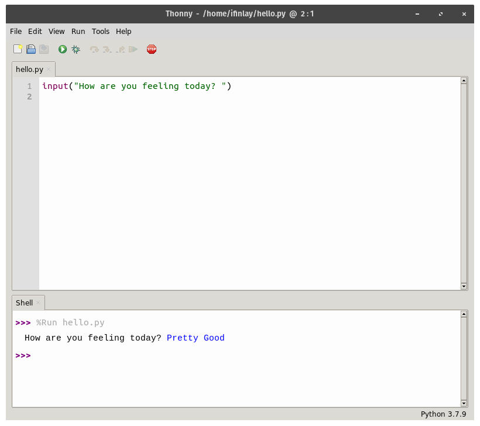

Chapter 3
=========

------------------------------------------------------------------------

First Programs {#first-programs .sub}
==============

::: {.blackbox}
::: {.blackbox-title}
**Learning Objectives**
:::

::: {.blackbox-contents}
-   Become comfortable writing programs which print messages to the
    screen.
-   Learn how to get user input into a program.
-   Understand how to create variables, and the rules for using them.
:::
:::

3.1 Output
----------

------------------------------------------------------------------------

In our first Python program, we saw the `print` function which prints
whatever message is put between the parenthesis. Here it is again:

``` {.python}
print("Hello World!")
```

`print` is the main way for doing output in Python. Of course, we can
have multiple print statements in a program. The following program has
three prints:

``` {.python}
print("Welcome to this program!")
print("Hello World!")
print("Bye bye!")
```

When a program has more than one line like this, Python will do them one
by one. This is an important point of programming. Unless we tell Python
otherwise, it starts with the first instruction, then goes through them
in order until it gets to the end.

So this program will print the first line, then the second, and then the
third. The output of this program looks like this:

``` {.output}
Welcome to this program!
Hello World!
Bye bye!
```

By the way, in this book, we will display code in the blocks with a
light grey background, and what the programs output with a darker
background like this.

As you can see, this program prints three lines of output, one for each
of our three print statements. We will look at more things we can do
with print statements in a bit, but first let\'s look at getting user
input.

3.2 Input
---------

------------------------------------------------------------------------

We can also do input in Python, when we want to ask the user for
information. Most programs take some sort of input, which allows us to
control what the program is doing, or what values it is calculating
with.

This can be done with the `input` function. Like `print`, `input` can
take a message inside of parenthesis. In the case of input, this message
is a question to give the user, called a **prompt**.

Here is an example of how `input` works[^1]:

``` {.python}
input("How are you feeling today? ")
```

When we run this program, it will print the prompt to the screen for us,
and then wait for us to type something in. To give the program the input
it\'s waiting for, we have to type into the shell window at the bottom
of the screen. When you type something in and hit enter, it will take
the input:



As you can see, Thonny colors what we are typing in blue, and what the
program prints as black. Here the input we gave the program was the
words \"Pretty Good\".

We can only type one line of text. As soon as we hit enter, Python moves
on from the input instruction. In this case, there is no next
instruction so the program finishes.

This program does not actually *do anything* with the input we give it.
In the program above, whatever the user types in can\'t really affect
the program at all. In order to do something with input, we must put it
into a *variable*.

3.2 Variables
-------------

------------------------------------------------------------------------

We talked about variables briefly when we were talking about algorithms
back in Chapter 1. Here we will talk about how to use them in Python.

Variables in programming are names that we associate with some piece of
information. Variables let us refer back to something that was created
earlier on in a program. They also let us save whatever the user inputs,
so we can keep track of it.

The way that a variable is created in Python is by putting the name on
the left hand side, then an equals sign, and finally the thing that you
want to store in the variable. For instance, if we want to save our
user\'s input in a variable, we could do it like this:

``` {.python}
answer = input("How are you feeling today? ")
```

Now when we run this program, it will ask us the question, and wait for
us to enter a response. It will then save whatever we give it into the
variable called `answer`. We can now change the program so that it
prints it back to us:

``` {.python}
answer = input("How are you feeling today? ")
print("You said")
print(answer)
```

Here is an example of the output of this program:

``` {.output}
How are you feeling today? pretty good
You said
pretty good
```

The text that we typed in is a different so that you can see what the
user types in this example. The white text is what the program itself is
printing out.

There are a couple of things to note about this program. First, we have
saved the input we typed into the variable called `answer`. We can then
print this variable out on the third line of the program. This line of
code is worth talking about:

``` {.python}
print(answer)
```

Notice how this did not actually print the word \"answer\". When we
print a variable, it doesn\'t print the variable\'s *name*, it prints
the variable\'s *value*. Whatever got stored in the variable (which is
whatever we typed in), gets printed here.

Also, notice how there are no quotation marks around \"answer\" in the
print command. If we put quotation marks in, it *would* actually have
printed out the word \"answer\". We have to use quotation marks to print
some message out exactly, and no quotation marks when we want to get the
thing stored in a variable.

There are some rules for naming our variables. The name of a variable
has to be made of letters, numbers and underscore characters. They
cannot begin with a number and cannot have spaces in them.

These are examples of legal variable names:

-   `price`
-   `price_in_dollars`
-   `priceFor2`

And these are not legal:

-   `full-price` (the - symbol is not allowed)
-   `2_times_price` (can\'t start with a number)
-   `price in dollars` (no spaces are allowed)

Variables also should not be named something that already means
something in Python. That means that you should not name a variable
`print` or `input`. There are lots of other names in Python that mean
things and we will see them as we go.

Notice that Thonny colors `print` and `input` differently than other
things. If the new variable you just made also shows up colored like
this, then it means something special and you should pick another name!

3.3 More on Printing
--------------------

------------------------------------------------------------------------

In the program above, we printed our message on two different lines,
which looks kind of weird. Instead, we can print it on one line, using
just one print instruction. To do that, we can pass the message and the
variable to print on one line, separated by a comma. That would look
like this:

``` {.python}
answer = input("How are you feeling today? ")
print("You said", answer)
```

When we run this program, it gives us this:

``` {.output}
How are you feeling today? pretty good
You said pretty good
```

There is no limit to how many things we can print like this --- we can
just keep adding things and putting commas between them. Like if we want
to also print \"Bye!\" so the user knows the program is done, we could
add that in:

``` {.python}
answer = input("How are you feeling today? ")
print("You said", answer, ". Bye!")
```

Now the program prints this:

``` {.output}
How are you feeling today? pretty good
You said pretty good . Bye!
```

Notice that Python automatically puts a space between the things that we
are printing. This is often helpful, but in this case makes the output
look kind of weird since there is a space before our period. When we
want to avoid this, we can also give the text `sep=""` to print. This
tells Python to separate the things it\'s printing with nothing at all.
Now the program looks like this:

**Program 3.1**

``` {.python}
answer = input("How are you feeling today? ")
print("You said ", answer, ". Bye!", sep="")
```

And it will output the following:

``` {.output}
How are you feeling today? pretty good
You said pretty good. Bye!
```

Note that we had to now put a space between \"You said\" and the
variable because now there isn\'t one put in automatically. Some people
aren\'t too bothered about details like this, but I like to get the
spacing to look exactly right for the program\'s output.

3.4 Example: Greeting Program
-----------------------------

------------------------------------------------------------------------

Now let\'s create a slightly longer program which will need two
variables. We\'ll talk about how the program will behave first, and then
talk about how to write it.

We want the program to ask the user for two things:

1.  Their name
2.  What day of the week it is

It will then give them a personalized greeting wishing them to have a
good day. For example, if we put in \"Nicole\" and \"Thursday\", then it
would print this:

``` {.output}
Hello Nicole!
Have a great Thursday!
```

However, if we put in \"Tim\" and \"Monday\" when the program asks our
name and what day it is, then it will print this:

``` {.output}
Hello Tim!
Have a great Monday!
```

This is an important point in programming --- what the program does will
depend on the input given to it. It means that we can\'t just write the
program like this:

``` {.python}
print("Hello Nicole!")
print("Have a great Thursday!")
```

If we did, then it works if your name is Nicole, and it happens to be
Thursday, but it won\'t work in any other case. You also can\'t just
replace \"Nicole\" and \"Thursday\" with your own name and day. If you
do, it will work for you that day, but not in any other situation.

What we want is to have the program do the right thing in *every*
situation. For that, we need to put the name and the day into variables.
We will need one for each thing. One variable generally keeps track of
just one piece of information.

We will start by asking the user their name and storing the result into
a variable:

``` {.python}
name = input("What is your name? ")
```

Next, we need to ask them for the other piece of information we need,
the day of the week:

``` {.python}
    day = input("What day is it? ")
```

Now we have these two variables, which we have called `name` and `day`.
The next step is to do the printing. Now we will use our variables so
that whatever answers they gave to those questions will be repeated:

``` {.python}
print("Hello ", name, "!", sep="")
```

This will print \"Hello \", followed by the user\'s name, and then an
exclamation point, with no spaces in between (so the exclamation shows
up right after their name).

Now it should greet them by name no matter what they put in. We can do
the same thing to wish them a good day:

``` {.python}
print("Have a great ", day, "!", sep="")
```

Below is the whole program, with a comment at the top. It\'s usually a
good idea to put a comment at the top of your code explaining what the
point of the program is.

**Program 3.2**

``` {.python}
# this program gives the user a custom greeting
name = input("What is your name? ")
day = input("What day is it? ")

print("Hello ", name, "!", sep="")
print("Have a great ", day, "!", sep="")
```

Notice the program also has a blank line in it. Blank lines are ignored
just like comments are. It\'s common in programs to put a blank line
between different sections of code --- kind of like paragraphs in a
paper.

Below is an example run --- though of course what it prints exactly
depends on what you tell it!

``` {.output}
What is your name? Mary
What day is it? Friday
Hello Mary!
Have a great Friday!
```

::: {.blackbox}
::: {.blackbox-title}
**Chapter Summary**
:::

::: {.blackbox-contents}
-   The `print` command is used to print things to the screen. You can
    pass multiple things to `print`, and it will print them one after
    the other.
-   The `input` command is used to get input from the user. Input should
    normally be stored into a variable.
-   Variables are used to keep track of information in a program. They
    are given a name of your choosing and can be referred to later.
:::
:::

Footnotes {#footnote-label .visually-hidden}
---------

[^1]: Notice the space after question mark. That is not necessary, but it
    puts a space before the user can start typing, which I think looks
    neater.

