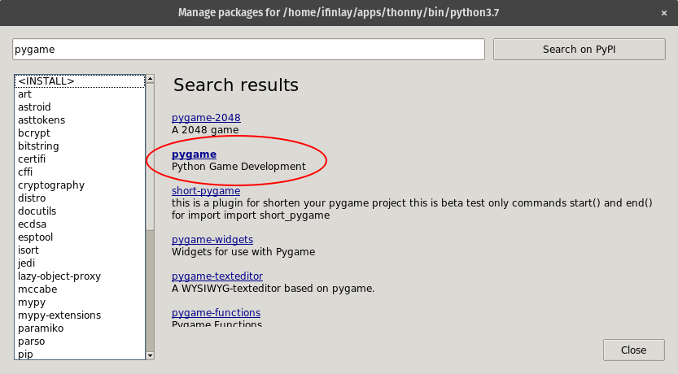
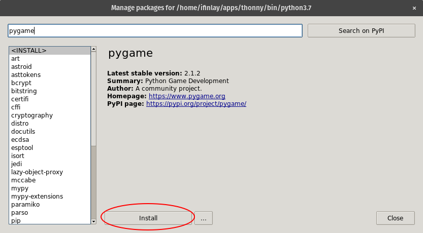

Chapter 11
==========

------------------------------------------------------------------------

Graphics Programming {#graphics-programming .sub}
====================

::: {.blackbox}
::: {.blackbox-title}
**Learning Objectives**
:::

::: {.blackbox-contents}
-   Learn how to create graphics windows
-   Understand the coordinate system used in graphics programs
-   Learn how colors are created in a computer program
-   Be able to create various graphics objects such as points, circles,
    lines and rectangles
-   Learn how to handle mouse and keyboard input in a graphics program
:::
:::

11.1 Installing the PyGame Library
----------------------------------

------------------------------------------------------------------------

As we talked about in [Chapter 8](chapter08), we can add libraries to
Python that other people have built and incorporate them into our own
programs. One of these is the *PyGame* library which allows us to make
graphical programs. We can use it to make games (hence the name), but it
can also be used for other graphical programs such as simulations, or
just having more colorful output.

To install it with Thonny, choose "Tools -\> Manage Packages" from the
main menu. Then search for "pygame" in the window that comes up:



The one we want is just called "PyGame", so click on that. Next click
the Install button:



It will take a moment or two to download. When it is finished, you
should have PyGame installed and be ready to write and run graphical
programs.

------------------------------------------------------------------------

11.2 PyGame Basics
------------------

The first thing we need to do is import the PyGame library. Recall from
[Chapter 8](chapter08) that this can be done with the `import` command:

``` {.python}
import pygame
```

Next, we need to call the PyGame `init()` function which sets up the
library, initializing it so we can call upon the other functions:

``` {.python}
pygame.init()
```

Now we can create a window. All of the programs we have written up to
this point have printed their results to the shell window. The shell is
purely textual, so to draw shapes, images, and other graphical things,
we need a window to put them in. We can create a window with this line
of code:

``` {.python}
window = pygame.display.set_mode([800, 600])
```

This `set_mode` function creates the window for us. Its parameter is a
list containing two numbers. The first number is how wide the window
should be and the second is how tall it should be.

These numbers refer to **pixels**, which is short for "picture
elements". All computer screens are made up of tiny lights that can
show up as different colors. These are called pixels. Your computer
monitor or laptop screen may have more or less pixels in it. A pretty
typical display these days might be 1,920 pixels wide and 1,080 pixels
tall. In this case, our 800x600 window takes up around a quarter of the
screen.

The window is where all of the things we draw will show up. Before we
can start talking about drawing things into the window, we need to
discuss how color is represented in computer programs.

------------------------------------------------------------------------

11.3 Colors
-----------

Just like everything else in computers, colors are ultimately stored as
numbers. The way this works is that we have three numbers for every
color: one for the amounts of red, green, and blue in the
color[^1]. Each of these three numbers ranges
from 0 to 255. The 255 limit may seem random, but that is the largest
number that can fit in one byte. 0 means there is none of that color at
all, and 255 means that color is turned up to the max.

For example, we could make a color with 100 for red, 240 for green and
215 for blue. This would be a light aquamarine sort of color like this
[    ]{style="background-color: #64f0d7"}. The easiest way to explore
colors like this is probably to [Google "color
picker"](https://www.google.com/search?q=color+picker) and play with
Google's built in color choosing tool. At the bottom left, you will see
the label "RGB" which indicates the three color components. This will
let you find the numbers for any color you want[^2].

Colors are put into programs with *tuples* which are sort of like lists
in Python except they use parentheses instead of square brackets. The
other difference is tuples can't be changed once they are created,
while lists can. We can assign our aquamarine color into a variable like
this:

``` {.python}
aqua = (100, 240, 215)
```

The numbers are always listed in the order of red, green, and then blue.
Here are some definitions for other common colors:

``` {.python}
red = (255, 0, 0)
green = (0, 255, 0)
blue = (0, 0, 255)

white = (255, 255, 255)
black = (0, 0, 0)
grey = (128, 128, 128)

yellow = (255, 255, 0)
orange = (255, 128, 0)
pink = (255, 0, 255)
purple = (128, 0, 255)
```

------------------------------------------------------------------------

11.4 Our First Graphical Program
--------------------------------

Now that we can create colors, we can create a complete program using
PyGame. The code for it is given first, then we will discuss it:

``` {.python}
import pygame

# setup PyGame
pygame.init()

# create a window
window = pygame.display.set_mode([800, 600])

# set some colors
white = (255, 255, 255)
orange = (255, 128, 0)

while True:
    # fill the window with a white color
    window.fill(white)

    # draw an orange circle in the window
    pygame.draw.circle(window, orange, (400, 300), 100)

    # flip the window
    pygame.display.flip()
```

We start by importing the PyGame library, calling the `init()` function
for it, and creating our window like before. Next we define two colors
for use in the program, a white for the background and an orange for a
circle. Of course we can change this to be whatever we want!

The rest of the program takes place in a while loop. Graphics programs
pretty much always have a main loop in them that keeps the program
running. If we didn't have a loop, the window would pop up briefly when
the program is run and close again when the program ends. Here the while
loop is an infinite one. To end this program, you'll have to hit
Thonny's "stop" button. Ideally, the program would end when the user
hits the 'X' to close the window instead. We'll see how to do that in
a little bit.

Inside the loop, we do three things. First we fill the window with a
white color by calling `.fill()` on the window and passing the color we
want it filled with.

Secondly, we draw an orange circle in the middle of the window. This is
done using `pygame.draw.circle()` which takes 4 parameters. The first is
what window we want the circle drawn into. Next is the color we want the
circle to appear as. After that we give it the coordinates of where the
center of the circle should appear. We talk about coordinates in the
next section, but (400, 300) is the middle of our 800x600 window.
Finally we pass 100 as the radius of the circle.

The third thing we do inside the loop is to "flip" the display.
PyGame, like most graphical systems, uses a technique called **page
flipping**. This means there are actually *two* graphical areas we
create: the one being shown to the user and the one being drawn on. When
we draw things like the orange circle, it gets drawn to the "back"
display which isn't visible. Then when we are done drawing everything,
we flip the displays so the user sees the new scene all at once. This
prevents the user from seeing a half-drawn scene which won't look
right.

------------------------------------------------------------------------

11.5 Coordinate Systems
-----------------------

Before we go much further, we need to talk about the coordinate system
used in computer graphics. What does it mean when we put in (400, 300)
for the circle's location?

Graphics systems typically use a coordinate system that is different
from that used by mathematics. In graphics, the origin, (0, 0) is at the
upper left corner of the window. The first coordinate, the X coordinate,
increases as we go from left to right. The second, or Y, coordinate
increases as we go from top to bottom (which is normally the opposite in
math).

This image illustrates the coordinate system:


This image shows the coordinates of each of the four corners of the
window. Notice that, like string indices, we start counting at pixel 0
and not pixel 1. Here, the window is 400 by 300 pixels large. That means
there are 120,000 pixels.

------------------------------------------------------------------------

11.6 Events
-----------

Having to end the program through Thonny is not ideal. The user should
be able to end the program by clicking the 'X' in the window bar like
usual. To do this, we need to look for the quit **event**. An event is
just something that might occur while our program is running, like the
user clicking the close button, pressing a key on the keyboard or
clicking the mouse.

By checking for these events, we can make our program respond to what
the user is doing. PyGame has a function called `pygame.event.get()`
which returns back a list of all the events that have occurred since the
last time we called it. We can then loop through this list and respond
to the events that we get.

This version of the program checks for the quit event. It uses a boolean
variable to keep track of whether the program is still running. When the
quit event is encountered, this variable is set to False. We also call
`pygame.quit()` at the end of the program.

``` {.python}
import pygame

# setup PyGame
pygame.init()

# create a window
window = pygame.display.set_mode([800, 600])

# set some colors
white = (255, 255, 255)
orange = (255, 128, 0)

running = True
while running:
    # check for events
    for event in pygame.event.get():
        if event.type == pygame.QUIT:
            running = False

    # fill the window with a white color
    window.fill(white)

    # draw an orange circle in the window
    pygame.draw.circle(window, orange, (400, 300), 100)

    # flip the window
    pygame.display.flip()

pygame.quit()
```

Now the program should close the window and stop running when the user
clicks the close button on the window bar.

------------------------------------------------------------------------

11.7 Keyboard and Motion
------------------------

We can get user input from the keyboard or the mouse using this method
as well. To check if a key is pressed, we can detect the `KEYDOWN`
event. Then we can check *which* key was pressed by checking `event.key`

For example, we could let the user also quit the program by hitting the
Escape key. To do this, we can add an `elif` to the code checking what
type of event was received. If it was a `KEYDOWN` event, then we can
check which key was pressed. If it was Escape, we can also set `running`
to `False`. The full list of keys is [available
here](https://www.pygame.org/docs/ref/key.html). The code for
implementing this:

``` {.python}
for event in pygame.event.get():
    # check what type of event it was
    if event.type == pygame.QUIT:
        running = False
    elif event.type == pygame.KEYDOWN:
        # check which key got pressed
        if event.key == pygame.K_ESCAPE:
            running = False
```

Another thing we can do with this is to let the user move the orange
circle around with the arrow keys. To do this, we can start by storing
the position of the circle in variables. That way we can change those
variables when the keys are pressed:

``` {.python}
# the position of the circle
x = 400
y = 300
```

Then when we draw the circle, we'll use these variables for the
position:

``` {.python}
pygame.draw.circle(window, orange, (x, y), 100)
```

Notice that we still need the extra parentheses because the position is
passed as a tuple. Now if we change the `x` or `y` variables, the change
will affect where the circle gets drawn to. We can do this by adding in
code to change these variables when the arrow keys are pressed. The full
code for this would look like this:

``` {.python}
import pygame

# setup PyGame
pygame.init()

# create a window
window = pygame.display.set_mode([800, 600])

# set some colors
white = (255, 255, 255)
orange = (255, 128, 0)

# the position of the circle
x = 400
y = 300

running = True
while running:
    # check for events
    for event in pygame.event.get():
        if event.type == pygame.QUIT:
            running = False
        elif event.type == pygame.KEYDOWN:
            # check which key got pressed
            if event.key == pygame.K_ESCAPE:
                running = False
            elif event.key == pygame.K_UP:
                y = y - 10
            elif event.key == pygame.K_DOWN:
                y = y + 10
            elif event.key == pygame.K_LEFT:
                x = x - 10
            elif event.key == pygame.K_RIGHT:
                x = x + 10

    # fill the window with a white color
    window.fill(white)

    # draw an orange circle in the window
    pygame.draw.circle(window, orange, (x, y), 100)

    # flip the window
    pygame.display.flip()

pygame.quit()
```

We add or subtract 10 pixels from one of `x` or `y` when an arrow key is
pressed. Note that when up is pressed we subtract 10 pixels. That's
because Y gets smaller towards the top of the window (which can be
confusing at first).

If you were using this approach to keyboard input and movement to make
something like a game, it would not really be ideal. Rather than have to
press they right key over and over to move the circle to the right, we
might like to *hold* the right key to have it continually move right.

To do this, we will need to look for both the key pressed and key
released events. When an arrow key is pressed, we can set the circle in
motion. When the arrow key is released we stop its motion. To this end,
we'll create two new variables for the circle. One keeps track of its
speed in the x direction and the other is the speed in the y direction.
These start off at 0 to mean the circle isn't moving to start off.

``` {.python}
xspeed = 0
yspeed = 0
```

We'll also make a variable for how fast the circle goes when it is
moving:

``` {.python}
movementSpeed = 1
```

Next we will check for both types of key events (presses and releases)
and set the `xspeed` and `yspeed` variables based on that:

``` {.python}
# a key was pressed down
elif event.type == pygame.KEYDOWN:
    if event.key == pygame.K_ESCAPE:
        running = False
    elif event.key == pygame.K_UP:
        yspeed = -movementSpeed
    elif event.key == pygame.K_DOWN:
        yspeed = movementSpeed
    elif event.key == pygame.K_LEFT:
        xspeed = -movementSpeed
    elif event.key == pygame.K_RIGHT:
        xspeed = movementSpeed

# a key was resleased
elif event.type == pygame.KEYUP:
    if event.key == pygame.K_UP or event.key == pygame.K_DOWN:
        yspeed = 0
    elif event.key == pygame.K_LEFT or event.key == pygame.K_RIGHT:
        xspeed = 0
```

When an arrow key is pressed down, we set the `xspeed` or `yspeed`
variable to either positive or negative `movementSpeed`. Which one
depends on which key it was. For the right arrow key, we want it to move
right so we set `xspeed` to positive `movementSpeed` which will indicate
the circle moves up in the X coordinate.

When an arrow key is released, we set the `xspeed` to 0 when it was the
left or right keys, which stop its side to side movement. And if the up
or down keys are released it stops moving up or down, so we set the
veritcal `yspeed` to 0.

Now the only thing to do is to take the speeds and use them to change
the position of the circle. We can do that with this code:

``` {.python}
# move the circle
x = x + xspeed
y = y + yspeed
```

This adds the speed into each of the two coordinates. So the way this
works is the user presses an arrow key, let's say the right key. This
sets `xspeed` to positive 1. Every time through the loop, the 1 is added
into `x`. So each time through it moves 1 pixel to the right. When the
user releases the right key, `xspeed` is set back to 0. Then the `x`
coordinate will no longer have anything added to it, so the circle
stops.

The full code for this example follows:

``` {.python}
import pygame

# setup PyGame
pygame.init()

# create a window
window = pygame.display.set_mode([800, 600])

# set some colors
white = (255, 255, 255)
orange = (255, 128, 0)

# the position of the circle
x = 400
y = 300

# the current speed of the circle
xspeed = 0
yspeed = 0

# how fast the circle can go when moving
movementSpeed = 1

running = True
while running:
    # check for events
    for event in pygame.event.get():
        if event.type == pygame.QUIT:
            running = False

        # a key was pressed down
        elif event.type == pygame.KEYDOWN:
            if event.key == pygame.K_ESCAPE:
                running = False
            elif event.key == pygame.K_UP:
                yspeed = -movementSpeed
            elif event.key == pygame.K_DOWN:
                yspeed = movementSpeed
            elif event.key == pygame.K_LEFT:
                xspeed = -movementSpeed
            elif event.key == pygame.K_RIGHT:
                xspeed = movementSpeed

        # a key was resleased
        elif event.type == pygame.KEYUP:
            if event.key == pygame.K_UP or event.key == pygame.K_DOWN:
                yspeed = 0
            elif event.key == pygame.K_LEFT or event.key == pygame.K_RIGHT:
                xspeed = 0

    # move the circle
    x = x + xspeed
    y = y + yspeed

    # fill the window with a white color
    window.fill(white)

    # draw an orange circle in the window
    pygame.draw.circle(window, orange, (x, y), 100)

    # flip the window
    pygame.display.flip()

pygame.quit()
```

------------------------------------------------------------------------

11.8 Drawing More Things
------------------------

Besides just circles, we can draw other shapes as well. The following
program draws a number of shapes to a window:

``` {.python}
import pygame
import math

pygame.init()

window = pygame.display.set_mode([800, 600])

running = True
while running:
    for event in pygame.event.get():
        if event.type == pygame.QUIT:
            running = False

    # Fill the background with light grey
    window.fill((240, 240, 240))

    # a red rectangle
    pygame.draw.rect(window, (255, 0, 0), pygame.Rect(50, 50, 150, 100))

    # a green ellipse
    pygame.draw.ellipse(window, (0, 255, 0), pygame.Rect(400, 100, 300, 200))

    # a blue polygon
    pygame.draw.polygon(window, (0, 0, 255), [(100, 300), (200, 300), (250, 350), (150, 400), (15, 350)])

    # an orange line
    pygame.draw.line(window, (255, 128, 0), (100, 500), (400, 550), 4)
    
    # a purple arc
    pygame.draw.arc(window, (150, 0, 180), pygame.Rect(500, 400, 100, 100), 0, math.pi/2)
    
    # Flip the display
    pygame.display.flip()

# Done! Time to quit.
pygame.quit()
```

The rectangle is drawn with:

``` {.python}
pygame.draw.rect(window, (255, 0, 0), pygame.Rect(50, 50, 150, 100))
```

Just like when drawing the circle, the first parameter is the window to
draw the rectangle to and the second is the color it should be. The
third parameter is the rectangle to draw. The `pygame.Rect` function
creates a rectangle given four parameters. They are:

1.  x coordinate
2.  y coordinate
3.  width
4.  height

Drawing an ellipse is done in a similar way. We used this code to draw a
green ellipse:

``` {.python}
pygame.draw.ellipse(window, (0, 255, 0), pygame.Rect(400, 100, 300, 200))
```

The parameters here mean the exact same thing. The only difference is
that the ellipse will be drawn inside the rectangle shape which is
given.

Drawing a polygon is done with this line of code:

``` {.python}
pygame.draw.polygon(window, (0, 0, 255), [(100, 300), (200, 300), (250, 350), (150, 400), (15, 350)])
```

Again the first two things are the window to draw to and the color. Then
the function takes a list of points which give the coordinates of the
points in the polygon.

A straight line can be drawn with code like this:

``` {.python}
pygame.draw.line(window, (255, 128, 0), (100, 500), (400, 550), 4)
```

After passing the window and the color for it, we pass two points which
give the ending points for the line. The last parameter is optional and
gives the thickness of the line.

Finally we can draw a curved line, called an arc with:

``` {.python}
pygame.draw.arc(window, (150, 0, 180), pygame.Rect(500, 400, 100, 100), 0, math.pi/2)
```

We pass the window and the color first. Next comes a rectangle which
bounds where the arc will be drawn (just like an ellipse). The last two
parameters are angles measured in radians. These two angles specify the
start and end angle for the arc.

------------------------------------------------------------------------

11.9 Drawing Images
-------------------

In addition to drawing these shapes, we can also load images from a file
and draw them to the window too. The first step in doing this is to load
the image file from your computer. We can do this with the
`pygame.image.load` function:

``` {.python}
picture = pygame.image.load("campus.png")
```

For this to work, the image file has to be in the same folder as your
Python program is saved to. PyGame can load several types of images
including PNG and JPG. Once the image is loaded into a variable, we can
draw it using code like this:

``` {.python}
window.blit(picture, (0, 0))
```

Instead of passing the window into a draw method, like for drawing
shapes, here we call `blit` on the window itself[^3].
The second parameter is where in the window the
upper-left corner of the image should appear. Here we pass the origin
(0, 0) so that the picture fills the whole window. You can download
[campus.png](images/campus.png) to run the program.

Footnotes {#footnote-label .visually-hidden}
---------

[^1]: In school you learned that red, yellow and blue are the three
    primary colors. That's true in a *subtractive* model of color, such
    as you get when mixing paints together. But there are other models
    of color, such as the *additive* model wherein you combine colored
    lights. In this model red, green, and blue are the three primary
    colors. Shining a red light and a green light together actually
    makes a yellow light!

[^2]: With this color scheme, there are actually over 16 million colors
    we could create. The human eye can only discern about 10 million
    different colors. So while theoretically there's really no limit on
    the number of colors, we can practically make any color we can
    imagine.

[^3]: The term "blit" is an old phrase in graphics and game
    programming. Its origin is an acronym for BLock Information
    Transfer. To blit something is to transfer it quickly from one part
    of memory to another. When you draw an image, you copy the image
    data onto the screen.

